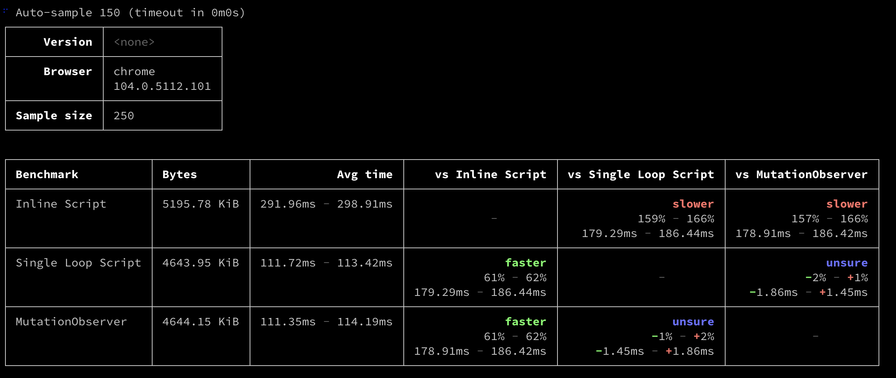

# Declarative ShadowDOM polyfill

## Summary

This RFC describes and compares different methods to polyfill [declarative ShadowDOM spec](https://web.dev/declarative-shadow-dom/). It discusses how to integrate them into LWC-SSR. Finally, it also can be used as a guide for application containers to decide which polyfill fits best their use case.

## Basic example

Let the following snippet represents an LWC SSR app output:

```html
<body>
    <x-content>
        <template shadowroot="open">
            <style>
                main {
                    background: #eee;
                    padding: 1rem;
                    border: 1px solid #aaa;
                    border-radius: 0.25rem;
                }
            </style>
            <h1>My article 2</h1>
            <main>
                <slot></slot>
            </main>
        </template>
    
        Lorem ipsum dolor sit amet, consectetur adipiscing elit, sed do eiusmod
        tempor incididunt ut labore et dolore magna aliqua. Ut enim ad minim
        veniam, quis nostrud exercitation ullamco laboris nisi ut aliquip ex ea
        commodo consequat. Duis aute irure dolor in reprehenderit in voluptate
        velit esse cillum dolore eu fugiat nulla pariatur. Excepteur sint occaecat
        cupidatat non proident, sunt in culpa qui officia deserunt mollit anim id
        est laborum.
    </x-content>
</body>
```

it renders correctly in Google Chrome but does not in browsers that not support Declarative ShadowDOM (e.g. Safari).

## Motivation

The primary goal of SSR is to get rendered content in front of the user as fast as possible, before enabling interactivity and eliminating all JS from SSR content. The Declarative Shadow DOM API was created to solve that goal (among others). The major browsers currently support the shadow dom API, but only Chrome supports the Declarative Shadow DOM API.

LWC-SSR (`@lwc/engine-server`) generates its HTML output in compliance with the Declarative Shadow DOM spec, and for teams to take full advantage of SSR, declarative shadow dom must be polyfilled in those late adopter browsers.

## Polyfills

This section describes different terms and solutions to polyfill the Declarative ShadowDOM spec. It will define invariants for any of the described polyfill implementations, and compare them using the common comparison points when polyfilling the spec.

### Invariants

1. We would only support native shadow DOM when rendering declarative shadow DOM, synthetic shadow DOM will be out of the picture.
2. The `getInnerHTML` method from the spec will not be polyfilled.
3. The new `ElementInternals.shadowRoot` will not be polyfilled.
4. For completeness, each polyfill removes the `<template>` element (and the inline `<script>` node when needed), so that the resulting tree is identical to the declarative output.

### Implementations

For the proposed polyfill to the Declarative Shadow DOM API spec, when comparing them to the native implementation in Chrome, the main comparison points are:

1. Performance: how fast does the polyfill transform LWC SSR rendered HTML into the proper DOM structure? There’s an extensive [analysis](https://github.com/mfreed7/declarative-shadow-dom/blob/master/README.md#performance) in the spec, comparing chrome native vs polyfills in chrome. For completion, the [Performance comparison in Chrome, Safari, and Firefox](#performance-comparison-in-chrome-safari-and-firefox) sections compare them in Safari and Firefox.
2. Does the polyfill take advantage of the browser streaming capability? For example, when you load a large page like https://html.spec.whatwg.org/ on a slow connection, you don’t need to wait for the page to load entirely to see content, the content will show immediately after it is parsed. Some examples are provided in [this repository](https://github.com/jodarove/dec-shadow-dom-polyfill-spike#examples).
3. Cumulative Layout Shift (CLS). CLS is the unexpected shifting of webpage elements while the page is still downloading, eg: Flash of Unstyled Content (FOUC). Compare the examples from [this repository](https://github.com/jodarove/dec-shadow-dom-polyfill-spike#examples).

#### Single loop script shadow root attachment ([reference](https://github.com/mfreed7/declarative-shadow-dom/blob/master/README.md#baseline-2---single-script-based-shadow-root-attachment))

Uses a single script at the end of the HTML that loops over all templates to attach the shadow roots and move the template contents into each root.

This approach is optimized for speed - the entire page is parsed first, and then one script does all of the shadow root attachment and population. The advantage here is that the parser is not blocked for `script` on each shadow root. The major **disadvantages** are:

1. Streaming is no longer possible. The entire page will consist of inert `<template>` elements that do not render, until the final script loops through and "converts" them into shadow roots.
2. Content shifts will likely occur. The initially-parsed result, if rendered, will not contain the shadow content. Once the final loop runs, and shadow roots are attached, the page layout will likely change, leading to CLS problems.

Compare the single loop example to the inline script in the [supplementary repository](https://github.com/jodarove/dec-shadow-dom-polyfill-spike#examples).


```js
<body>
    <div>
        <template shadowroot="open"></template>
        <script type="text/javascript">
            replaceTemplateWithShadowRoot(document.currentScript);
        </script>
    </div>
    <script type="text/javascript">
        function supportsDeclarativeShadowDOM() {
            return HTMLTemplateElement.prototype.hasOwnProperty("shadowRoot");
        }
    
        function polyfillDeclarativeShadowDom(docOrShadowRoot) {
            docOrShadowRoot.querySelectorAll('template[shadowroot]').forEach((template) => {
                const mode = template.getAttribute('shadowroot');
                const shadowRoot = template.parentNode.attachShadow({ mode });
                shadowRoot.appendChild(template.content);
                template.remove();
    
                polyfillDeclarativeShadowDom(shadowRoot);
            });
        }
    
        if (!supportsDeclarativeShadowDOM()) {
            polyfillDeclarativeShadowDom(document);
        }
    </script>
</body>
```

#### Inline script shadow root attachment ([reference](https://github.com/mfreed7/declarative-shadow-dom/blob/master/README.md#baseline-1---inline-script-based-shadow-root-attachment))

This approach uses an inline script placed just after each `<template>` to attach the shadow root and move the template contents into the root. The shadow root is attached and populated immediately after it is parsed so that content streaming is possible.

This approach is the most straightforward replica of a declarative shadow dom solution - the shadow root is attached and populated immediately after it is parsed, so that content streaming is possible. The main **disadvantage** of this approach is performance.


```html
<head>
    <script type="text/javascript">
        function supportsDeclarativeShadowDOM() {
            return HTMLTemplateElement.prototype.hasOwnProperty("shadowRoot");
        }

        const replaceTemplateWithShadowRoot = supportsDeclarativeShadowDOM()
            ? (currentScript) => currentScript.remove()
            : (currentScript) => {
                const template = currentScript.previousElementSibling;
                const mode = template.getAttribute('shadowroot');
                const shadowRoot = template.parentElement.attachShadow({ mode });
                shadowRoot.appendChild(template.content);
                // These two lines didn't affect performance appreciably:
                template.remove();
                currentScript.remove();
            };
    </script>
</head>
<body>
    <div>
        <template shadowroot="open"></template>
        <script type="text/javascript">
            replaceTemplateWithShadowRoot(document.currentScript);
        </script>
    </div>
</body>
```

#### Single MutationObserver based ([reference](https://github.com/mfreed7/declarative-shadow-dom/blob/master/README.md#baseline-3---single-mutationobserver-based-polyfill-script))

This polyfill uses a single synchronous polyfill script at the top of the HTML, which installs a `MutationObserver` that attaches shadow roots to any `<template shadowroot>` elements that it finds, and moves the template contents into each root.

This approach is an attempt to get closer to the streaming (and lower CLS) inline script solution, while attempting to mitigate the parsing and compilation time required for repeated inline scripts. The major **disadvantages** here are:

* This MutationObserver must be placed on `document.body`, and must observe all node additions to the document. This significantly slows down tree building, given the JS overhead for each element.
* There is no "children finished parsing" mutation event. This means that the mutation observer in this polyfill must simply assume that by the time the callback is called, all of the children of the given `<template>` have already been parsed and appended to the tree. If the parser happens to yield in the middle of a `<template>` block, part of the children will be lost by this polyfill.

```html
<body>
    <script type="text/javascript">
        function supportsDeclarativeShadowDOM() {
            return HTMLTemplateElement.prototype.hasOwnProperty("shadowRoot");
        }
        function attachShadowRoots(mutationsList) {
            for (let mutation of mutationsList) {
                for (let n of mutation.addedNodes) {
                    if (n.tagName === 'TEMPLATE') {
                        const mode = n.getAttribute('shadowroot');
                        const shadowRoot = n.parentElement.attachShadow({mode});
                        shadowRoot.appendChild(n.content);
                        n.remove();
                    }
                }
            }
        }

        if (!supportsDeclarativeShadowDOM()) {
            (new MutationObserver(attachShadowRoots)).observe(document.body,
                { childList: true, subtree: true, attributeFilter: [ "shadowroot" ], });
        }
    </script>
    <div>
        <template shadowroot="open"></template>
    </div>
</body>
```

### Performance comparison in Chrome, Safari, and Firefox

These performance tests are using [tachometer](https://www.npmjs.com/package/tachometer), and compares the three different approach using 5k web components on the page. To eliminate forced style/layout, SSR-rendered web components are inside a `<div>` with `display:none` and `contain:strict` . The code used for this comparison can be found [here](https://github.com/jodarove/dec-shadow-dom-polyfill-spike#performance-tests).

**CHROME**
Despite Chrome natively supporting declarative shadow dom, we measure the speeds of the polyfills, because in the case of the inline script, the script element must be removed.

<figure>
  
  <figcaption align = "center">
    <b>Fig.1: Performance comparison in Google Chrome</b>
  </figcaption>
</figure>
 
 
 
**SAFARI**
<figure>
  
  <figcaption align="center">
    <b>Fig.2: Performance comparison in Safari</b>
  </figcaption>
</figure>
 
 
 
**FIREFOX**

<figure>
  
  <figcaption align="center">
    <b>Fig.3: Performance comparison in Mozilla Firefox</b>
  </figcaption>
</figure>

## LWC and Declarative ShadowDOM polyfills

From the three polyfills described in this RFC, LWC currently supports without any modification the [Single script shadow root attachment](#single-loop-script-shadow-root-attachment-reference) and the [Single MutationObserver](#single-mutationobserver-based-reference) polyfill. In order to support the [inline script polyfill](#inline-script-shadow-root-attachment-reference) approach, the application container will need to modify the SSR output, or LWC to provide a mechanism to modify the SSR output to include the script after the template.

This RFC proposes that **there will be no modification** to the existing API of `@lwc/engine-server` to support the inline script polyfill approach.

The proposed solution to application containers that want to use the inline-script approach, is to do string manipulation to add the script after the template tag of the SSR output. Example:


```js
import { renderComponent as lwcRenderComponent} from '@lwc/engine-server';

const polyfill = `<script type="text/javascript">replaceTemplateWithShadowRoot(document.currentScript);</script>`;

export function renderComponent(ceName, ctor, props) {
   const originalSSROutput = lwcRenderComponent(ceName, ctor, props);
   /* renders
    <x-foo>
        <template shadowroot="open">
            <div class="foo">
                <x-btn class="x-btn_btn-host">
                    <template shadowroot="open">
                        <button class="foo x-btn_btn">click me</button>
                    </template>
                </x-btn>
            </div>
        </template>
    </x-foo>
   */
   
   return originalSSROutput.replaceAll("</template>", `</template>${polyfill}`);
   /* returns:
    <x-foo>
        <template shadowroot="open">
            <div class="foo">
                <x-btn class="x-btn_btn-host">
                    <template shadowroot="open">
                        <button class="foo x-btn_btn">click me</button>
                    </template><script type="text/javascript">replaceTemplateWithShadowRoot(document.currentScript);</script>
                </x-btn>
            </div>
        </template><script type="text/javascript">replaceTemplateWithShadowRoot(document.currentScript);</script>
    </x-foo>
    */
}
```

Other alternative solutions were taken into account, but at the moment there’s not a strong use case for them, and other than removing the extra string manipulation operation, there’s no added benefit.

#### Alternative Solutions

**EXPOSE OPTION TO THE EXISTING API**

This approach adds a new argument to the `renderComponent` method of `@lwc/engine-server` (or similar approach) that you can use in order to tell the LWC SSR serializer to modify parts of the output. For example:


```js
renderComponent(tagName, Ctor, props); // --> 
renderComponent(tagName, Ctor, props, options = {});

// Example usage:

renderComponent(
    'x-app',
    App,
    {},
    {
        contentAfterTemplate: `<script type="text/javascript">replaceTemplateWithShadowRoot(document.currentScript);</script>`,
    }
);
```


**FULL CUSTOMIZATION OF SERIALIZER**

This approach allows application developers to extend the SSR serializer in order to specialize parts of the generated output. The main benefit of this is that the application developer now can have granular control over the serialization process. At the same time, this is one of the main drawbacks because now we had to expose and maintain a new API for `@lwc/engine-server` that today abstract the spec of declarative shadow dom.

```js
import { setSerializer } from '@lwc/engine-server';

const polyfill = `<script type="text/javascript">replaceTemplateWithShadowRoot(document.currentScript);</script>`;

// serializeShadowRoot(shadowRoot, serializerApi)
function serializeShadowRoot({ mode, delegateFocus, children }, { serializeChildNodes }) {
    const attrs = [`shadowroot="${mode}"`];

    if (delegatesFocus) {
        attrs.push('shadowrootdelegatesfocus');
    }

    return `<template ${attrs.join(' ')}>${serializeChildNodes(children)}</template>${polyfill}`;
}

setSerializer({
   serializeShadowRoot,
}) 
```


## Adoption strategy

We will have to communicate very clearly that at the moment, Declarative ShadowDOM (LWC SSR output) is only supported in Google Chrome, for the output to be displayed correctly in other browsers (that support shadow dom, see [invariants](#invariants)) the developers will need to add a polyfill.

## How do we teach this

We add a new section to the [Server-Side Rendering](https://lwc.dev/guide/ssr), explaining that while browsers adopt the Declarative ShadowDOM spec, they need to include a polyfill, add the [Single loop script shadow root attachment (reference)](#single-loop-script-shadow-root-attachment-reference) approach, and point them to this RFC for other alternatives.

## Unresolved questions

None at this time.

## References

1. [Declarative Shadow DOM spec (rendered)](https://web.dev/declarative-shadow-dom/)
2. [Declarative Shadow DOM spec](https://github.com/mfreed7/declarative-shadow-dom/blob/master/README.md)
3. [Supplemental repository](https://github.com/jodarove/dec-shadow-dom-polyfill-spike#examples)
4. [LWC Guide](https://lwc.dev/guide)