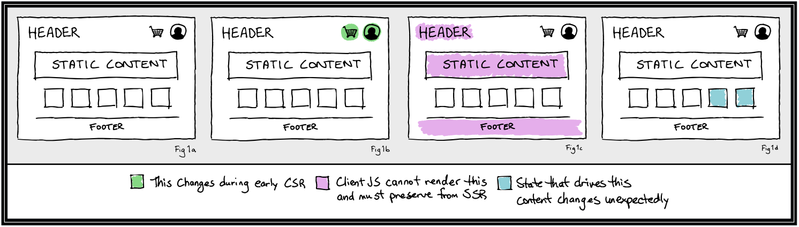
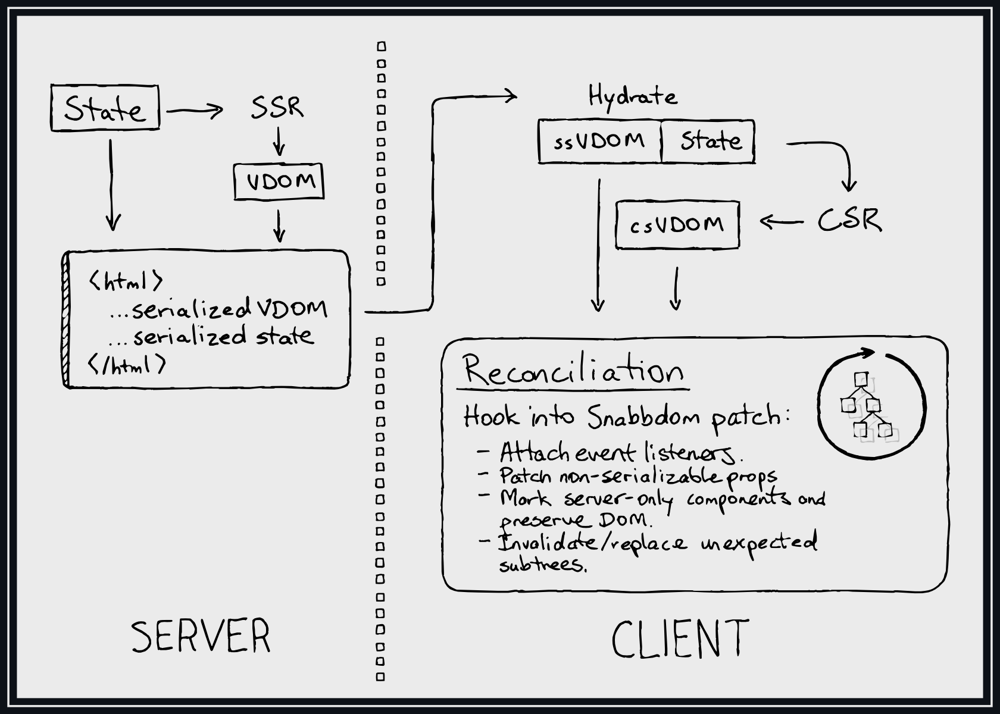
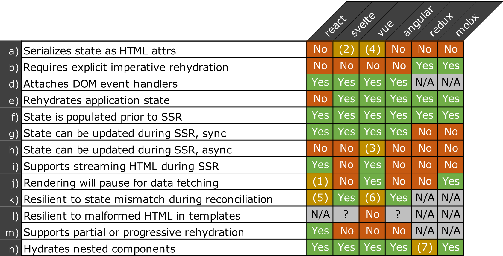

# SSR Rehydration

## Summary

Whereas server-side rendering (SSR) allows a web application to be rendered into HTML on the server, rehydration involves receiving that HTML on the client and reusing the resulting DOM during initial client-side rendering (CSR).

This document proposes an approach to supporting SSR rehydration in LWC.

## Problem description

### Motivation

The motivations for SSR are [well documented](https://medium.com/walmartglobaltech/the-benefits-of-server-side-rendering-over-client-side-rendering-5d07ff2cefe8) and can be boiled down to the following two points:

- SSR allows search engines to easily index URLs that would otherwise be rendered on the client as part of a web application. This results in improved [SEO](https://developers.google.com/search/docs/beginner/seo-starter-guide), with all the associated benefits.

- SSR can improve the perceived startup performance of a web application by reducing the time to [First Contentful Paint](https://web.dev/first-contentful-paint/). Optimizing perceived performance can have measurable impact on [conversion rates](https://www.cloudflare.com/learning/performance/more/website-performance-conversion-rates/), [user satisfaction](https://www.ericsson.com/en/press-releases/2016/2/streaming-delays-mentally-taxing-for-smartphone-users-ericsson-mobility-report), and [revenue](https://www.dareboost.com/en/webperf-impacts).

However, rendering on the server can itself introduce performance issues, working against the original intent. Namely, if DOM that was generated from SSR HTML is not preserved during the initial CSR, this will result in potentially expensive DOM manipulation and unwanted visual artifacts.

The aim of rehydration is to avoid the client-side performance issues of a naive SSR implementation, reusing original DOM wherever possible.

### The happy path

With regard to SSR, there exists a happy path (Fig 1a) where the rendering output for a given request is identical on both the server and the client; identical VDOM is generated for the entire document in both environments.

Depending upon the actual implementation, exceptions to this happy path include:

- **Special Case A:** One or more components are intentionally rendered differently on the server and on the client (Fig 1b). For example, a placeholder may be rendered on the server and later replaced on the client.
  - **Example:** The page contains a cart icon with a dynamic number of items in cart.
  - **Example:** The page contains a user avatar.
- **Special Case B:** One or more components are rendered only on the server (Fig 1c). No JS is sent to the client for these components and the original SSR'd HTML remains untouched by hydration and later client-side renders.
  - **Example:** The page contains a footer that never changes.
  - **Example:** The landing page is mostly static and is cached on a CDN.
- **Special Case C:** Render-critical state is changed between the time of SSR and CSR rehydration, causing an unexpected mismatch (Fig 1d).
  - **Example:** A product price is updated after SSR but before rehydration on the client.
  - **Example:** The CDN delivers a stale version of the landing page, which was updated after the SSR HTML was en route to the client.

<figure>
  
  <figcaption align = "center">
    <b>Fig.1: the happy path and special case exceptions</b>
  </figcaption>
</figure>

## Design

Several pieces need to come together to unlock rehydration. The general flow is illustrated below in figure 2.

<figure>
  
  <figcaption align = "center">
    <b>Fig.2: the proposed implementation</b>
  </figcaption>
</figure><br /><br />

In roughly chronological order with respect to a single page request, the following steps shall be taken as part of rehydration:

- Rather than calling `LWC#createElement`, it is required that `LWC#hydrateElement` be called to mount the root Lightning Web Component on the client.
  + `hydrateElement` will accept `props` for the root element; these must be identical to what was passed to `renderComponent` during SSR.
  + Just as on the server, any state pulled in by `@wire` must be pre-fetched and available synchronously prior to calling `hydrateElement` (or `renderComponent` on the server).
- Instantiate the root component, generating client-side VDOM.
- Patch SSR DOM with client-side VDOM.
  - Attach event listeners and non-serializable props.
  - Resolve inconsistencies in text nodes in favor of client-side values.
  - Resolve other unexpected inconsistencies in favor of the client-side VDOM, at a per-component granularity, addressing [Special Case C](#the-happy-path). With the exception of placeholder components, this case should be rare.

**Note:** We will not serialize `@api` or `@track` state on the server and rehydrate on the client. State will only be accepted for the root component via `hydrateElement`, and it is beholden on downstream developers to ensure their server-side and client-side state is identical.

### Bailing out

There is a spectrum of choices possible when encountering an unexpected mismatch during rehydration. The following is a sampling from that spectrum:

1. Bail out of rehydration entirely when a mismatch is detected, throw away the original HTML, and force a full re-render.
2. Handle easy mismatches (text nodes, certain attrs, etc.) falling back to number 1 for anything more extreme.
3. Bail out of rehydration for subtrees, rooted at the component where the mismatch occurred.
4. Bail out of rehydration for subtrees, rooted at the mismatch itself.
5. Try to repair as much of the SSR-derived DOM as possible, throwing nothing away explicitly.
6. Assume no mismatches exist, and break silently.

The approach that we propose for adoption is #3. Specifically:

- We detect a mismatch
- We patch "easily recoverable" mismatches in the DOM, e.g. text-node mismatches
- For mismatches that are not easily recoverable
  + We determine the closest LWC ancestor to that mismatch (anywhere from the root component in a SPA to a leaf component for a small widget).
  + We invalidate the ancestor's subtree, replacing SSR-derived DOM with CSR DOM for that component subtree only.

If we determine that this behavior has undesirable performance characteristics, we will pivot to approach #2.

### Recovering from lifecycle errors

It might happen that an error is thrown while invoking the `connectedCallback` or other lifecycle method. This situation could occur because:

1. The userland lifecycle method has a bug.
2. The state extracted from the SSR DOM is incorrect for some reason, leading to unexpected inputs and behavior in the lifecycle method.

We will want to recover from #2. And because it won't be possible to differentiate #1 and #2 at runtime, a catch-all solution must be adopted.

It is proposed that, should an error be thrown during `connectedCallback`, we should assume that an unexpected mismatch has occurred, throw away the SSR DOM, and replace it with CSR VDOM. The `connectedCallback` will then be invoked again (`connectedCallback` can fire more than once), this time for the CSR DOM.

If an error occurs again, we can assume its proximate cause is in userland and not in LWC.


### `hydrateElement`

In a typical LWC web application, a developer might mount their app using the following pattern:

```javascript
import { createElement } from 'lwc';
import MyApp from './my-app';

document
  .querySelector("#root")
  .appendChild(createElement('my-app', { is: MyApp }));
```

After the proposed change, if a developer wants to take advantage of rehydration, a developer would instead do:

```javascript
import { hydrateElement } from 'lwc';
import MyApp from './my-app';

hydrateElement(document.querySelector('#root'), MyApp, { some: props }); 
```

`hydrateElement` accepts three arguments:

1. The already-existing DOM node where the root component should be attached.
2. The LWC class intended for use as the root component.
3. Any props that should be supplied to that root component as part of the initial client-side render.

### Constructable stylesheets

The introduction of constructable stylesheets to LWC presents a small wrinkle. Since support for this browser API is not yet ubiquitous, we cannot know during SSR whether it will be supported on the client. For that reason, constructable stylesheets are disabled during SSR.

From there, we have two options if support for constructable stylesheets is detected during rehydration:

1. Swap in constructable stylesheets for vanilla stylesheets.
2. Disable constructable stylesheets during hydration, for the lifetime of the component instance.

It is believed that swapping in constructable stylesheets could obviate the performance wins that constructable stylesheets are intended to bring. Furthermore, any theoretical benefit is outweighed by the implementation complexity of swapping in constructable stylesheets.

For these reasons, it is proposed that constructable stylesheets be disabled during hydration, and during the lifetime of the component instance.

### Server-only components

Addressing [Special Case B](#the-happy-path) will involve a solution roughly comparable to [React server components](https://reactjs.org/blog/2020/12/21/data-fetching-with-react-server-components.html). While the bulk of this can be implemented in user-land, at a level of abstraction above LWC, the `hydrateElement` patch implementation will need to support the use-case.

However, we consider support for this case to be out-of-scope for the initial implementation. We will explore further as part of a separate RFC.

### SSR placeholders

Implementation of placeholder components, as described in [Special Case A](#the-happy-path) should require no extra effort, so long as unexpected subtree mismatches (Special Case C) are dealt with properly.

The following is an example of how this _might_ be accomplished, although it is important to note that any such implementation is outside the scope of LWC and should be handled downstream.

<details closed>
  <summary>Example:</summary>

Implementation in user-land is possible with simple runtime environment detection:

```javascript
import { LightningElement } from 'lwc';
import { isNodeEnv } from './my-utils';
import tmplServerPlaceholder from './templateServer.html';
import tmplClient from './templateClient.html';

export default class ElementWithSSRPlaceholder extends LightningElement {
    render() {
        return process.browser ? tmplClient : tmplServerPlaceholder;
    }
}
```

Alternately, if it is desirable _not_ to ship the placeholder in the client-side bundle, one could utilize a Babel transform or `@rollup/plugin-replace` to make the necessary changes at build time.

```javascript
import { LightningElement } from 'lwc';
import { isNodeEnv } from './my-utils';
// ↶ removed from client builds during minification
import tmplServerPlaceholder from './templateServer.html';
import tmplClient from './templateClient.html';

export default class ElementWithSSRPlaceholder extends LightningElement {
    render() {
        return process.browser
            ? tmplServerPlaceholder
            : tmplClient;
        /*
          For client builds, further minification iterations will result in:
            1. return false ? tmplServerPlaceholder : tmplClient
            2. return tmplClient
        */
    }
}
```

</details>

### `customElements.define`

Without safe-guards, it might happen that `customElements.define` is invoked with SSR-serialized custom elements already in the DOM prior to the invocation of `hydrateElement`, leading to unexpected behavior. The following list enumerates the conditions that may be encountered and how we plan to handle them.

- **Condition:** `customElements.define` is invoked before `hydrateElement` (whether or not `hydrateElement` is later called) in a port-SSR context.
  + **Behavior:** `customElements.define` will check whether any elements with the specified tag name (e.g. `x-foo`) are already present in the DOM. When found, these elements will be treated as though `hydrateElement` had been invoked on them with no props provided.
  + **Alternatives Considered:**
    * An error could be thrown, entirely disallowing use of `customElements.define` in a post-SSR context.
    * LWC components already initialized and attached to DOM nodes could be replaced when `customElements.define` is invoked.
  + **Rationale:** The chosen behavior seems an unsurprising default, without introducing unnecessary constraints or complexity.
- **Condition:** `hydrateElement` is invoked on a DOM element that was already hydrated by `customElements.define`.
  + **Behavior:** A warning will be logged to the console and the hydration will be a no-op.
  + **Alternatives Considered:**
    * This case could be treated in the same way as an unrecoverable SSR/CSR mismatch, replacing all DOM nodes below the root element.
    * A scheme could be developed to permit and define behavior for multiple hydrations.
  + **Rationale:** Multiple hydrations would be difficult to manage, with unclear edge cases. Additionally, because there isn't an apparent good reason why a downstream developer would want to do this, warning them is likely the most helpful behavior.
- **Condition:** During rehydration (i.e. after the invocation of `hydrateElement` or `customElements.define`), a child node is encountered that was previously rehydrated.
  + **Behavior:**
    * If HTML attributes for the child component are identical to those in the CSR VDOM, the already-hydrated child component will be left alone and assumed to be correct.
    * If HTML attributes are _not_ identical, the child component's DOM will be replaced with CSR VDOM, treating the situation as an unexpected mismatch.
  + **Alternatives Considered:**
    * The prescribed approach could be taken with the addition of a warning logged to console.
    * DOM for already-hydrated child components could be replaced in all cases, rather than checking for matching attributes.
  + **Rationale:** The prescribed approach balances permissiveness for benign cases while providing reasonable guarantees about correctness.
- **Condition:** `customElements.define` is invoked for a component that has already been rehydrated.
  + **Behavior:** DOM nodes already attached to component instances will be left alone, and the custom element will be registered for future changes to the DOM. 
  + **Alternatives Considered:**
    * New component instances could be created for each matching tag in the DOM, replacing nodes in place.
  + **Rationale:** A downstream developer would probably expect that calling `customElements.define` does not break an application that was functioning correctly prior to the invocation. The developer would likely also expect that future insertions of `<x-foo>` in the DOM would be handled by `Foo` constructors if it had been registered by `customElements.define`.

## Sundry

- **LightDOM:** We do not believe there are significant boundaries to supporting LightDOM + SSR rehydration, so the use case will be supported.
- **Declarative Shadow DOM:** We believe that critical stakeholders will eventually want full support for rehydrating declarative shadow DOM. However, lack of cross-browser support may complicate matters significantly, and the use cases are not yet fully understood. A follow-up RFC will address our approach in this area.
- **Synthetic Shadow:** Unless a compelling use case presents itself, we will not support rehydration with synthetic shadow enabled.

## How we teach this

Much like the new functionality itself, the documentation for SSR rehydration is purely additive. We won't be changing the behavior or API of existing features.

Beneficial documentation may include:

- an introductory blog post, explaining the underlying implementation

- a new section in the [LWC Guide](https://lwc.dev/guide/introduction), explaining the SSR-specific APIs and demonstrating how to get SSR up and running

- an addition to the [LWC Recipes](https://recipes.lwc.dev/) or an example application utilizing SSR

# Survey of prior art

A handful of influential web frameworks and state management libraries were examined in relation to rehydration and adjacent concerns. The findings are summarized as follows:



**Notes:**

1. React 17 will feature enable Suspense on the server. Functionality is currently available through a third-party library.
2. Svelte stores information for associating DOM nodes with components in the `<head>`.
3. Vue will await async data fetch at the component level, using `serverPrefetch`.
4. Vue annotates root SSR nodes with HTML attrs denoting them as server rendered.
5. Prior to React 16, rehydration could handle any mismatch between SSR and CSR VDOM. After React 16, only text nodes can mismatch.
6. In development mode, Vue checks server-rendered DOM against client-rendered DOM. In production, this is disabled for performance reasons.
7. It is technically possible but difficult to utilize nested stores alongside SSR, and not provided out-of-the-box.
