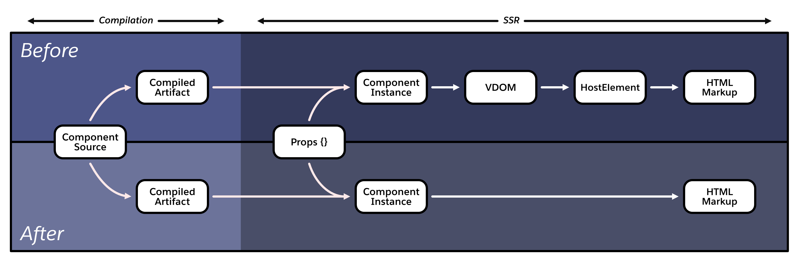
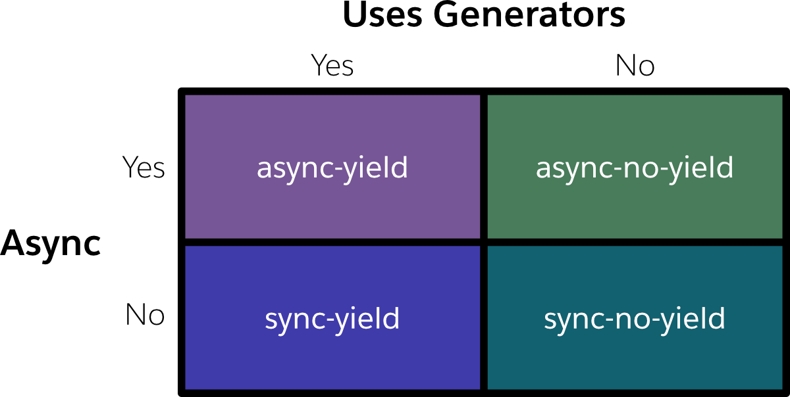
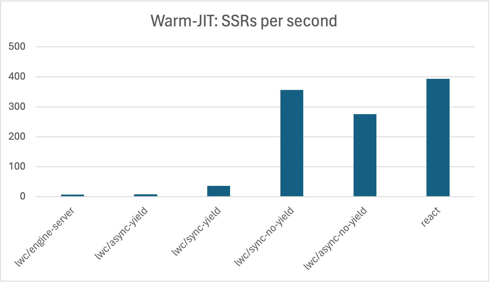
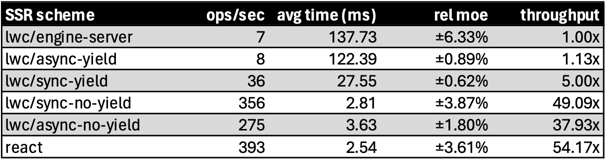
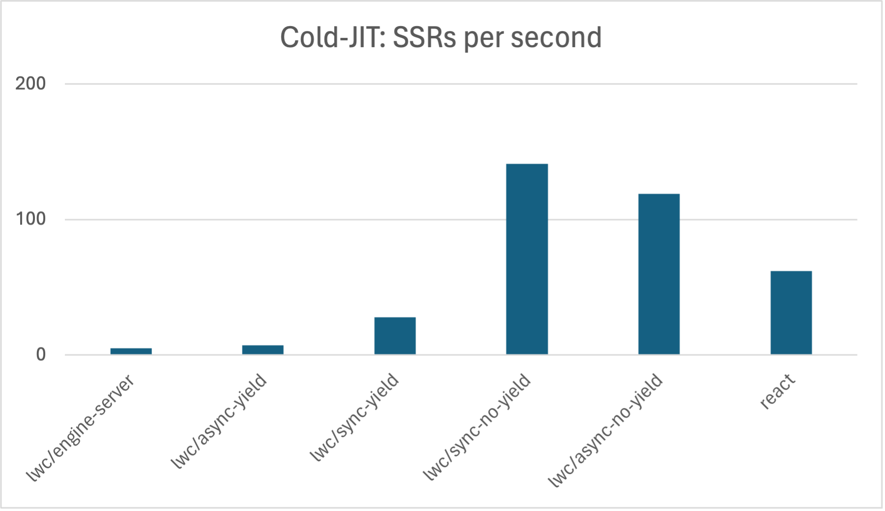
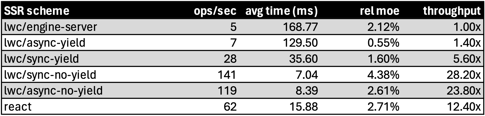
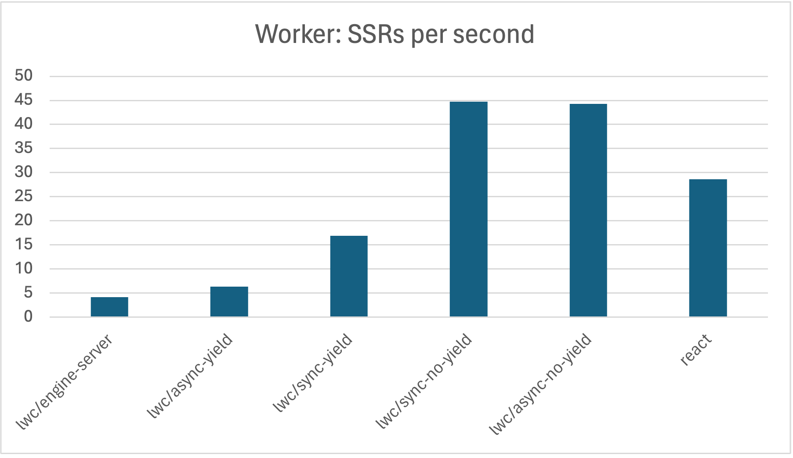
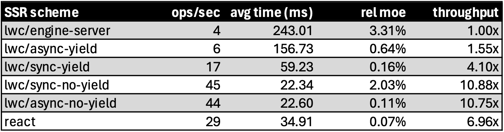
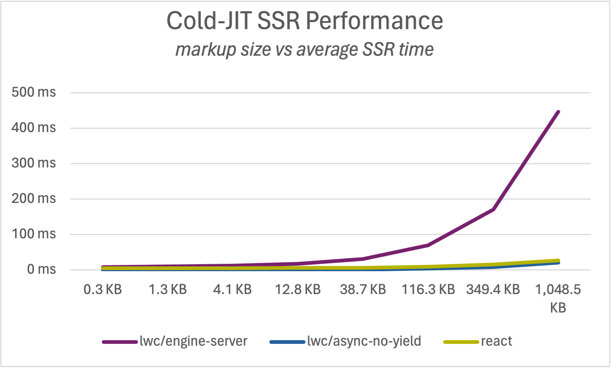
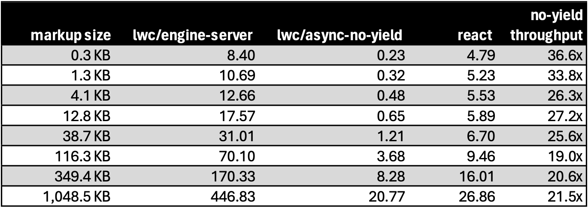

# Improving SSR performance with a specialized compiler

**Note:** This subject was originally explored internally. However, the RFC is being shared here for posterity.

## Summary & goals

Today, there is a single LWC compiler that takes a component’s JS, HTML & CSS and produces a compiled artifact for use at run-time. These artifacts are invoked in both CSR and SSR environments, and interact with runtimes that correspond to the execution environment: `@lwc/engine-dom` and `@lwc/engine-server`.

This approach to SSR in LWC & the larger Salesforce platform brings with it some noteworthy constraints:

* rendering on the server is slow
    * the abstractions used in the server setting are roughly 1:1 to those used in the browser
    * many of these abstractions are costly
* rendering on the server is synchronous
    * there is no mechanism to pause rendering
    * there is no way to discover data dependencies during render & await the corresponding fetch

The proposal aims to address these two issues: synchronicity and slowness.

[Experience Delivery](https://help.salesforce.com/s/articleView?language=en_US&id=release-notes.rn_experiences_delivery.htm&release=250&type=5) platform context: According to preliminary analysis, LWC's SSR implementation (currently exposed as renderComponent) accounts for a large portion of rendering time in both cold-JIT scenarios (median 200 ms) and warm-JIT scenarios (median 180 ms). Variance may be a factor here and the numbers are preliminary but a reasonable basis for estimating possible performance gains.

## New paradigm vs old

In our existing SSR implementation, the process to render a component mirrors that of client-side rendering:

1. someone calls renderComponent, providing a handle to the component class and the props for the root component
2. the component is instantiated
3. the instance is associated with a “DOM” element; on the server, we call this the HostElement rather than HTMLElement
4. connectedCallback is invoked
5. the template function is called, returning VDOM
6. VDOM is transformed into HostElements
7. steps 1-6 are repeated for any children, recursively
8. we serialize the tree of HostElements into HTML markup

However, much of this machinery and abstraction is only truly necessary to support interactivity and subsequent renders. Neither interactivity nor subsequent renders are necessary in the SSR context.

The new SSR implementation streamlines this process, stripping away intermediate steps and rendering directly to markup. At a high level, it looks something like this:

<figure>
  
  <figcaption align = "center">
    <b>Fig. 1: a comparison of the SSR flow with existing vs proposed implementations</b>
  </figcaption>
</figure>

## SSR schemes

Four new SSR “schemes” appear throughout the rest of this document - each one a variant of the single newly-proposed approach. In each scheme, the anatomy of compiled output is very similar; also, the work to compile these various schemes is roughly identical. However, there are small differences between them that result in notably different performance characteristics and functional capabilities.

<figure>
  
  <figcaption align = "center">
    <b>Fig. 2: a matrix of variants to the newly proposed SSR implementation</b>
  </figcaption>
</figure>

The `async-yield` implementation was the first of these new schemes to be developed. Generator functions allowed for more readable generated code. Asynchronous generator functions were chosen to facilitate pauses during rendering, enabling patterns such as async data fetching after rendering has started.

The `*-no-yield` schemes were developed after experimentation revealed that use of generators results in an unnecessary performance hit.

Conceptually, all four schemes share much in common. At runtime (when SSR is generating markup), the hierarchy of components translates roughly into a comparable call stack, with each component corresponding with N (currently two) stack frames. In other words, this...

```
 <c-foo>
   <c-bar>
     text child
   </c-bar>
 </c-foo>
 ```

... roughly turns into this at runtime:

```
generateMarkup('c-foo', props)
└─ tmpl(props, Cmp, instance)
   └─ generateMarkup('c-bar', props)
      └─ tmpl(props, Cmp, instance)
```

Each of these `generateMarkup` and `tmpl` functions are unique to each component.

LWC’s compiler architecture compiles templates, stylesheets, and JavaScript discretely, only assembling them at the end. Because this new implementation reuses what it can, this compilation pattern is preserved; the generateMarkup function serves to instantiate the component class and acts as the glue between the component instance and its template function.

All statements made so far in this section hold true for all of the new SSR schemes. The differences come when examining what kind of call stack is involved (synchronous vs asynchronous) as well as how the generated string segments are communicated up to the top of the call stack (`yield` vs function call).

The following very-dumbed-down examples may help illustrate the differences between these schemes:

`async-yield`:

```
async function* B () {
  yield '<c-b>';
  await tbdAsyncThing();
  yield '</c-b>';
}
async function* A () {
  yield '<c-a>'
  yield* B();
  yield '</c-a>';
}
await collect(A(props));
```

**Note:** the sync-yield scheme looks identical to the above, minus the async and await keywords.

`sync-no-yield`:

```
function B (emit) {
  emit('<c-b>');
  // you have no async
  // power here, Gandalf
  emit('</c-b>');
}
function A (emit) {
  emit('<c-a>');
  B(emit);
  emit('</c-a>');
}
let str = '';
let emit = (s) str += s;
A(emit, props);
```

`async-no-yield`:

```
async function B (emit){
  emit('<c-b>');
  await tbdAsyncThing();
  emit('</c-b>');
}
async function A (emit){
  emit('<c-a>');
  await B(emit);
  emit('</c-a>');
}
let str = '';
let emit = (s) str += s;
await A(emit, props);
```


These are the only differences between the four schemes. The process to construct the compiled JavaScript is identical across all schemes. The relationship between the compiled JavaScript and the component source is also identical. The high-level anatomy of the compiled output is identical.

The only remaining difference is a superficial one: the API that LWC exposes. Async schemes would probably return a `Promise<string>` whereas the sync schemes would just return a string.

Briefly: streaming markup prior to completion of rendering is possible with all of these new schemes. However, doing so introduces new problems that are not explored in this document. For example, what happens if a component deep in the tree throws an error after half of the HTML has already been sent over the wire to the browser?

## Performance

To determine which scheme might be best, a benchmark was created to compare their performance. The benchmark is [available on GitHub](https://github.com/divmain/lwc-ssr-perf/tree/main).

**Disclaimer:** A synthetic benchmark running on a local developer machine cannot fully reflect performance characteristics in production under varied workloads & runtime conditions. In other words, the numbers shared below are intended to reveal relative differences between the schemes, not guaranteed numbers. Real-world performance may vary.

### Methodology

Most of the work to produce statistically significant numbers is deferred to [tinybench](https://github.com/tinylibs/tinybench). Each iteration is run in isolation, with a concurrency of 1. This is true even when the iterations are running in worker threads.

Garbage collection is manually triggered in between runs; earlier versions of the benchmark omitted this, which resulted in GC pauses that severely skewed the results.

The following data points are provided:

* **ops/sec**: the number of times HTML markup can be sequentially generated per second for a given input; higher is better
* **avg time (ms)**: the mean time taken to generate markup, i.e. `sum(iterations) / iterations.length`; lower is better
* **rel moe**: the relative margin of error seen across the samples taken
* **throughput**: the ratio of a given scheme's ops/sec relative to the slowest scheme; higher is better

### Scheme vs scheme vs React

In the following sections, each new SSR scheme is compared against the others. In addition, they are compared against `@lwc/engine-server` (our current SSR implementation) and React. The React source code is obviously not 1:1 identical to the LWC component code. However, a React implementation was created that is both 1) behaviorally equivalent, and 2) idiomatic to React.

React does not have the fastest SSR implementation of all other web frameworks. However, it is effectively the industry standard of today, and was chosen for that reason.

The workload chosen for the following sections involves generating a large amount of markup: approximately 350 KB. This is (hopefully) at the higher end of anything we might be generating in production in LWR@MRT. However, bigger workloads make for clear comparisons. A comparison at both smaller & larger sizes is provided further down in the document.

#### Warm-JIT

In this benchmark, the JavaScript engine was allowed to JIT-optimize the code that generates markup. This is comparable to a persistent Node.js process running in a hot Heroku dyno; it is not comparable to a one-off AWS lambda-like environment.

The existing LWC implementation is quite slow. React is 54 times faster. However, the sync-no-yield scheme comes close to React’s performance: roughly 49 times faster than our existing implementation.

<figure>
  
  <figcaption align = "center">
    <b>Fig. 3: warm-JIT rendering speeds of schemes compared</b>
  </figcaption>
</figure>

<figure>
  
  <figcaption align = "center">
    <b>Fig. 4: warm-JIT rendering speeds of schemes compared, cont</b>
  </figcaption>
</figure>

#### Cold-JIT

For each iteration in this benchmark, the JavaScript was executed in a way that ensured the JIT-compilation & bytecode caching from previous iterations would have no effect.

Here, the new `no-yield` implementations are clear winners, clocking in at roughly 24 times faster than our existing implementation. They are also twice as fast as React SSR; this is likely due to the cost of JIT-compiling the React runtime.

`@lwc/engine-server` performs very poorly in this benchmark, also likely due to the mass of runtime code that needs to be JIT-compiled each time, as well as overhead from multiple intermediate representations & associated memory allocations.

<figure>
  
  <figcaption align = "center">
    <b>Fig. 5: cold-JIT rendering speeds of schemes compared</b>
  </figcaption>
</figure>

<figure>
  
  <figcaption align = "center">
    <b>Fig. 6: cold-JIT rendering speeds of schemes compared, cont</b>
  </figcaption>
</figure>

#### Running in a worker thread

For each iteration in this benchmark, a new worker thread was spun up. As soon as the thread is ready, computation begins.

The shape of the results here mirror those of the Cold-JIT setup. However, there is additional overhead, possibly due to creation of the thread itself.

Depending on whether we can address higher-impact HTTP response bottlenecks, it may be worth investing in a sandboxing mechanism other than freshly minted worker threads.


<figure>
  
  <figcaption align = "center">
    <b>Fig. 7: isolated worker thread rendering speeds of schemes compared</b>
  </figcaption>
</figure>

<figure>
  
  <figcaption align = "center">
    <b>Fig. 8: isolated worker thread rendering speeds of schemes compared, cont</b>
  </figcaption>
</figure>

#### Peak memory usage

While the question of memory usage for each of the schemes is not terribly consequential, some measurements were taken. To establish a baseline, the following command was run & its memory consumption measured:

```
node -e 'console.log("hello world")'
```

Each of the schemes was exercised for a single iteration each & configured to produce markup with a size of approximately 350 KB. The memory measurements were as follows:

|                    | Maximum Resident Set (KB) |
|--------------------|--------------------------:|
|  lwc/engine-server |                     44336 |
|    lwc/async-yield |                     42720 |
|     lwc/sync-yield |                     38480 |
| lwc/async-no-yield |                     30752 |
|           baseline |                     30720 |
|  lwc/sync-no-yield |                     30272 |

Amusingly, the `sync-no-yield` scheme consumes less memory than the baseline. My best conjecture as to why this might happen is that the use of `console.log` results in JIT compilation of some of Node.js’s JavaScript (Node’s codebase consists of roughly the same amounts of C++ and JavaScript code). It may also pull natively compiled code into memory that interacts with OS abstractions for STDOUT.

### SSR time as a function of markup size

In previous measurements, only workloads of a single size have been examined, where the output size is approximately 350 KB. However, that is not the only size that matters, nor does it necessarily constitute a regularly-seen workload in production.

Additional measurements are reported in the chart & graph to the right. Cold-JIT SSR performance was chosen, as this likely corresponds most closely to the LWR@MRT production environment in CDN-cache-miss scenarios.

Because the `async-no-yield` scheme is recommended below, it was chosen to square off against both the existing `@lwc/engine-server` and React implementations.

Average time is reported; lower is better. The `async-no-yield` scheme uniformly comes out ahead: 20-36 times faster than `@lwc/engine-server`. Except in extreme cases, it also beats React by at least a factor of 2.

<figure>
  
  <figcaption align = "center">
    <b>Fig. 9: markup size vs rendering speed</b>
  </figcaption>
</figure>

<figure>
  
  <figcaption align = "center">
    <b>Fig. 10: markup size vs rendering speed, cont</b>
  </figcaption>
</figure>

## Recommended path forward

While the `sync-no-yield` SSR scheme outperforms all others in most scenarios, the recommended path forward is `async-no-yield`. Its performance is in the same ballpark as its synchronous counterpart, while also allowing LWRJS or LDS or other partners to leverage asynchronicity when advantageous.

For example, it may not always be possible to determine what data a component tree will need prior to actual invocation. Asynchronously pausing rendering would allow for these data dependencies to be discovered during SSR. This would be beneficial in the following ways:

* During SSR, we’re closer to the data source. We may still need to fetch data, but we eliminate the latency of network round trips. Fetched data can be serialized alongside the SSR response, where it wouldn’t have to be fetched again on the client. This has the potential to improve TTI.
* If data is required to accurately render a component tree, doing so during SSR allows for more (ideally all) of the component hierarchy to be rendered during SSR. This has the potential to improve LCP.

Improving TTI and LCP would come at the potential cost of TTFB. However, of the three, the two that improve correlate more closely to the performance perceived by an end user.

To be clear, this implementation would not open the door to any component author to make their `connectedCallback` asynchronous and block SSR. It would, however, provide a mechanism to enable targeted & purposeful use of async code to improve overall performance & functionality.

## Appendix: Measurements on a VM

After the initial measurements taken on the MacBook Pro M1 & subsequent analysis, additional measurements were taken on a 2-vCPU virtual machine (in DigitalOcean, due to ease of access) with 2 GB of memory running on an SSD.

### Cold-JIT render times

The following graph shows columns of markup size and the consequent rendering speed in milliseconds for each implementation.

|                    | 1.27 KB | 4.14 KB | 12.77 KB | 38.67 KB | 116.34 KB | 349.38 KB |
|-------------------:|--------:|--------:|---------:|---------:|----------:|----------:|
|  lwc/engine-server |   44.72 |   55.78 |    87.90 |   161.28 |    394.01 |    795.62 |
|    lwc/async-yield |    3.03 |   15.64 |    42.49 |    85.73 |    182.56 |    459.30 |
|     lwc/sync-yield |    2.46 |   10.47 |    19.75 |    31.38 |     62.27 |    143.58 |
|  lwc/sync-no-yield |    1.61 |    2.64 |     3.32 |     5.19 |     14.18 |     42.03 |
| lwc/async-no-yield |    1.70 |    2.48 |     3.42 |     6.00 |     34.55 |     54.84 |
|              react |   22.00 |   22.92 |    23.94 |    27.06 |     50.49 |     83.02 |

### Hot-JIT render times (milliseconds)

The following graph shows columns of markup size and the consequent rendering speed in milliseconds for each implementation.

|                    | 1.27 KB | 4.14 KB | 12.77 KB | 38.67 KB | 116.34 KB | 349.38 KB |
|--------------------|--------:|--------:|---------:|---------:|----------:|----------:|
|  lwc/engine-server |    2.14 |    7.00 |    25.19 |    79.55 |    227.99 |    639.57 |
|    lwc/async-yield |    0.37 |    1.76 |     8.46 |    36.34 |    131.89 |    433.73 |
|     lwc/sync-yield |    0.11 |    0.49 |     2.02 |     7.52 |     29.45 |    106.16 |
|  lwc/sync-no-yield |    0.05 |    0.16 |     0.55 |     1.54 |      5.06 |     18.21 |
| lwc/async-no-yield |    0.06 |    0.22 |     0.67 |     2.09 |      6.44 |     21.38 |
|              react |    0.03 |    0.10 |     0.28 |     0.84 |      3.27 |     18.10 |

